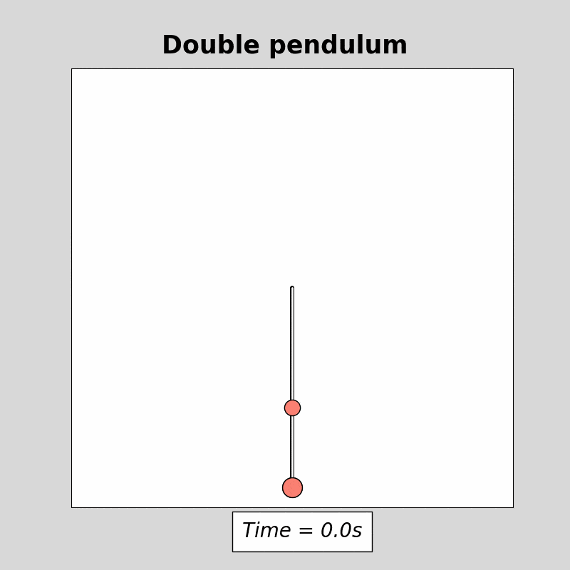

This model simulates the motion of a double pendulum system, which consists of two masses $m_1$ and $m_2$ connected by rigid rods of lengths $L_1$ and $L_2$. Given the initial angles $\theta_1$ and $\theta_2$, angular velocities $\dot{\theta}_1$ and $\dot{\theta}_2$, and the gravitational acceleration $g$, the model calculates the angular accelerations $\ddot{\theta}_1$ and $\ddot{\theta}_2$ based on the nonlinear, coupled differential equations governing the double pendulum.

The expressions for $\ddot{\theta}_1$ and $\ddot{\theta}_2$ are given by:

$$
\ddot{\theta}_1 = \frac{m_2 g \sin \theta_2 \cos (\theta_1 - \theta_2) - m_2 \sin (\theta_1 - \theta_2) \left[l_1 \dot{z}_1^2 \cos (\theta_1 - \theta_2) + l_2 \dot{z}_2^2 \right] - (m_1 + m_2) g \sin \theta_1}{l_1 \left[ m_1 + m_2 \sin^2 (\theta_1 - \theta_2) \right]}
$$

$$
\ddot{\theta}_2 = \frac{(m_1 + m_2) \left[ l_1 \dot{z}_1^2 \sin (\theta_1 - \theta_2) - g \sin \theta_2 + g \sin \theta_1 \cos (\theta_1 - \theta_2) \right] + m_2 l_2 \dot{z}_2^2 \sin (\theta_1 - \theta_2) \cos (\theta_1 - \theta_2)}{l_2 \left[ m_1 + m_2 \sin^2 (\theta_1 - \theta_2) \right]}
$$

These equations capture the dynamic, coupled nature of the system and are solved numerically to simulate the pendulum's motion over time.
